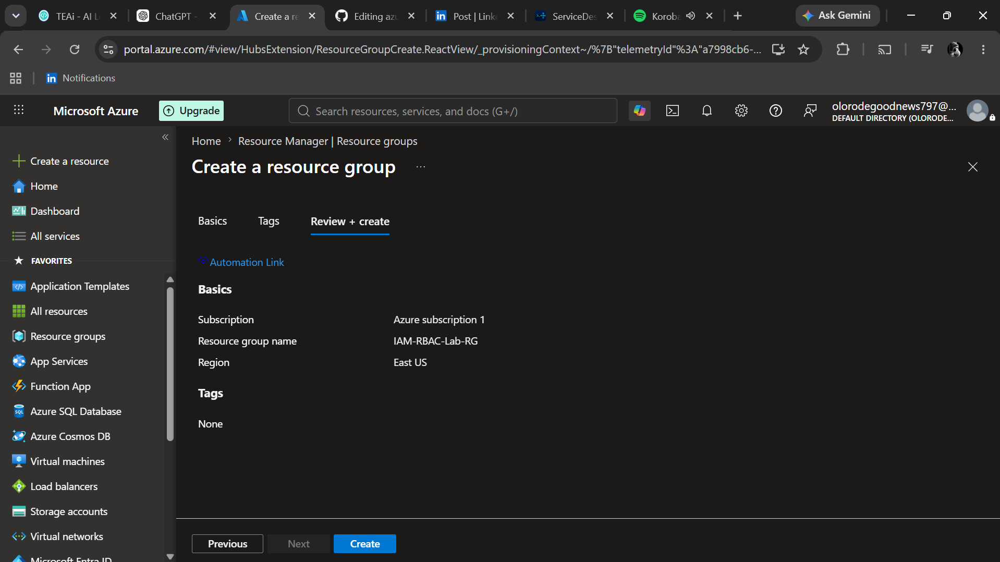
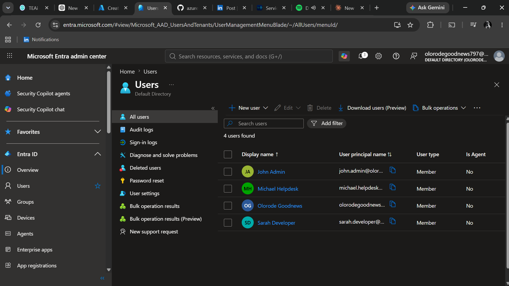
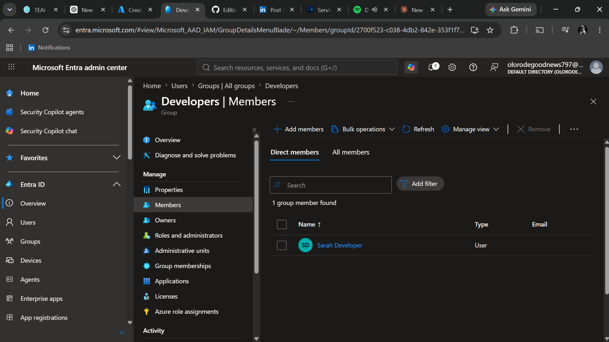

# azure-iam-rbac-lab
This project demonstrates how to manage identities and control access to Azure resources using Microsoft Entra ID and Azure Role-Based Access Control (RBAC).
## Step 1 – Create a Resource Group

The first task in this lab was creating a dedicated Resource Group to contain all resources used throughout the project.

### Configuration

| Setting | Value |
|---------|-------|
| Resource Group | IAM-RBAC-Lab-RG |
| Scope | Subscription |
| Purpose | Container for Azure IAM & RBAC resources |

### Why?

Resource Groups provide a logical way to organize Azure resources and provide a scope for assigning Azure Role-Based Access Control (RBAC) permissions. This makes it easier to manage related resources and apply access permissions consistently across the project.

### Result

The Resource Group was successfully deployed and is ready to host all resources required for this Azure IAM & RBAC lab.

### Screenshot

.

## Step 2 – Create Microsoft Entra ID Users

### Objective

The goal of this step was to create test users in Microsoft Entra ID to simulate employees in an organization. These users will later be assigned to security groups and Azure RBAC roles.

### Users Created

| Display Name | Role |
|--------------|------|
| John Admin | Administrator |
| Sarah Developer | Developer |
| Michael HelpDesk | Help Desk |

### Why?

Microsoft Entra ID stores and manages user identities in Azure. Creating separate users allows administrators to assign permissions based on job responsibilities instead of granting everyone the same level of access.

### Result

Three users were successfully created in Microsoft Entra ID and are ready to be assigned to security groups and Azure RBAC roles.

### Screenshot

## Step 3 – Create a Security Group

### Objective

The goal of this step was to create a Security Group in Microsoft Entra ID to simplify access management.

### Group Details

| Setting | Value |
|---------|-------|
| Group Name | Developers |
| Group Type | Security |
| Membership Type | Assigned |

### Member Added

- Sarah Developer

### Why?

Security Groups allow administrators to assign Azure RBAC permissions to a group instead of individual users. This simplifies management and ensures consistent access for users performing similar job functions.

### Result

A Security Group named **Developers** was successfully created, and Sarah Developer was added as a member.

### Screenshot

