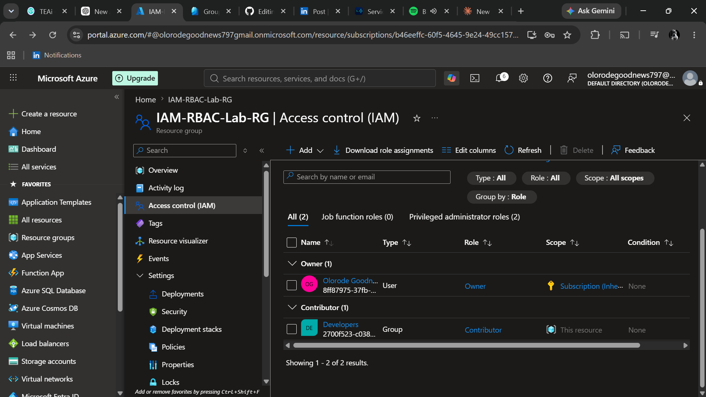
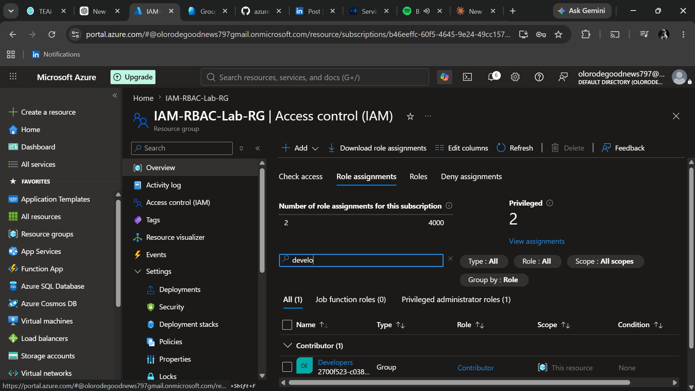

# azure-iam-rbac-lab
This project demonstrates how to manage identities and control access to Azure resources using Microsoft Entra ID and Azure Role-Based Access Control (RBAC).
## Step 1 – Create a Resource Group

The first task in this lab was creating a dedicated Resource Group to contain all resources used throughout the project.

### Configuration

| Setting | Value |
|---------|-------|
| Resource Group | IAM-RBAC-Lab-RG |
| Scope | Subscription |
| Purpose | Container for Azure IAM & RBAC resources |

### Why?

Resource Groups provide a logical way to organize Azure resources and provide a scope for assigning Azure Role-Based Access Control (RBAC) permissions. This makes it easier to manage related resources and apply access permissions consistently across the project.

### Result

The Resource Group was successfully deployed and is ready to host all resources required for this Azure IAM & RBAC lab.

### Screenshot

.

## Step 2 – Create Microsoft Entra ID Users

### Objective

The goal of this step was to create test users in Microsoft Entra ID to simulate employees in an organization. These users will later be assigned to security groups and Azure RBAC roles.

### Users Created

| Display Name | Role |
|--------------|------|
| John Admin | Administrator |
| Sarah Developer | Developer |
| Michael HelpDesk | Help Desk |

### Why?

Microsoft Entra ID stores and manages user identities in Azure. Creating separate users allows administrators to assign permissions based on job responsibilities instead of granting everyone the same level of access.

### Result

Three users were successfully created in Microsoft Entra ID and are ready to be assigned to security groups and Azure RBAC roles.

### Screenshot

## Step 3 – Create a Security Group

### Objective

The goal of this step was to create a Security Group in Microsoft Entra ID to simplify access management.

### Group Details

| Setting | Value |
|---------|-------|
| Group Name | Developers |
| Group Type | Security |
| Membership Type | Assigned |

### Member Added

- Sarah Developer

### Why?

Security Groups allow administrators to assign Azure RBAC permissions to a group instead of individual users. This simplifies management and ensures consistent access for users performing similar job functions.

### Result

A Security Group named **Developers** was successfully created, and Sarah Developer was added as a member.

### Screenshot

## Step 4 – Assign Azure RBAC Role

### Objective

Assign the **Contributor** role to the **Developers** security group at the Resource Group scope.

### Configuration

| Setting | Value |
|---------|-------|
| Scope | IAM-RBAC-Lab-RG |
| Role | Contributor |
| Principal | Developers (Security Group) |

### Why?

Azure RBAC provides fine-grained access management for Azure resources. Assigning permissions to a security group instead of individual users simplifies administration and ensures that all group members inherit the appropriate permissions.

### Result

The **Developers** security group was successfully assigned the **Contributor** role for the Resource Group. Members of the group can now create, modify, and manage resources within the Resource Group, but they cannot grant permissions to others.

### Screenshot

## Step 5 – Verify Azure RBAC Role Assignment

### Objective

The final step was to verify that the Azure RBAC role assignment was successfully applied to the **Developers** security group.

### Verification

The **Developers** group appears in the Resource Group's **Role assignments** with the **Contributor** role.

### Why?

Verifying role assignments ensures that Azure RBAC has been configured correctly and that members of the security group inherit the expected permissions.

### Result

The **Developers** security group successfully inherited the **Contributor** role at the Resource Group scope, confirming that the RBAC configuration is functioning as intended.

### Screenshot

## Step 6 – Resource Cleanup

### Objective

Delete Azure resources that are no longer required after completing the lab.

### Why?

Removing unused resources helps prevent unnecessary costs and keeps the Azure subscription organized.

### Result

The Resource Group can be deleted after the lab is completed, which also removes all resources contained within it.

## Project Summary

In this lab, I demonstrated how to manage identities and control access to Azure resources using Microsoft Entra ID and Azure Role-Based Access Control (RBAC).

### Skills Demonstrated

- Resource Group Management
- Microsoft Entra ID User Management
- Security Group Management
- Azure Role-Based Access Control (RBAC)
- Access Management
- Principle of Least Privilege

### Key Takeaways

- Microsoft Entra ID manages identities.
- Azure RBAC controls access to Azure resources.
- Security Groups simplify permission management.
- Assigning permissions to groups is more scalable than assigning permissions to individual users.
- Verifying role assignments ensures the correct permissions are applied.
